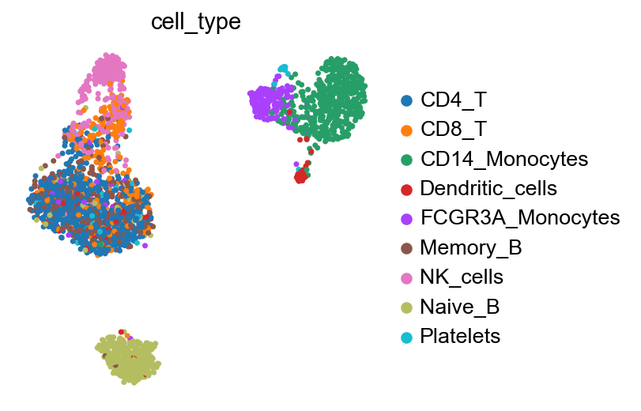
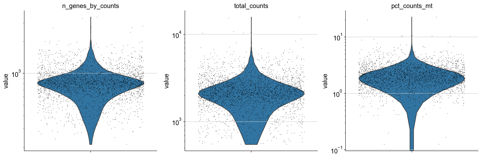
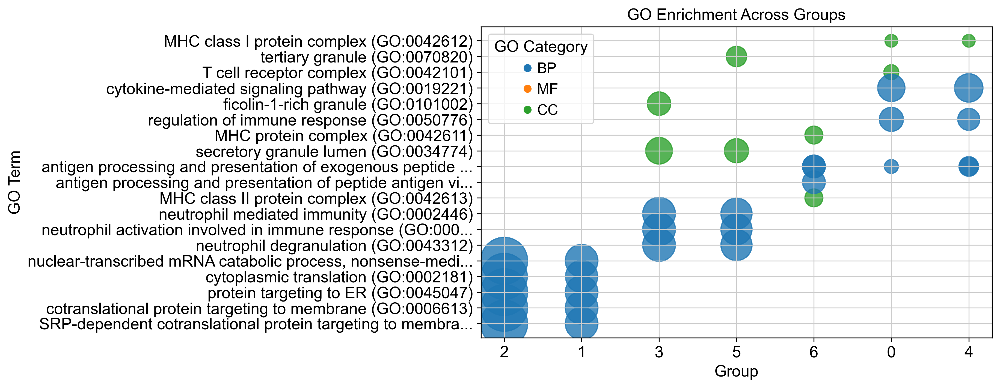

# 🧬 scRNA-seq Analysis Pipeline (PBMC 3K) | Scanpy

A fully automated and reproducible single-cell RNA-seq analysis pipeline built with **Python (Scanpy)**.

## 🚀 What this project does

This pipeline performs a complete scRNA-seq analysis workflow:

* Data loading (10x Genomics format)
* Quality control (QC) & filtering
* Normalization & highly variable gene selection
* PCA, neighborhood graph & clustering (Leiden)
* UMAP visualization
* Differential gene expression analysis
* Functional enrichment (GO / KEGG)
* Automatic result saving + PDF report generation

👉 Just provide your dataset and run the notebook — the entire analysis is executed automatically.

---

## 📊 Example Results

### UMAP Clustering



### QC Metrics



### Differential Expression



---

## ⚙️ Key Features

* ✅ Fully automated pipeline (minimal user input)
* ✅ Configurable via a single cell
* ✅ Reproducible and modular design
* ✅ Saves intermediate checkpoints (.h5ad)
* ✅ Generates publication-ready figures
* ✅ Exports results + PDF summary report

---

## 📁 Project Structure

```
.
├── notebooks/
├── data/
├── results/
├── figures/
├── configs/
```

---

## 🧪 Dataset

* PBMC 3K (10x Genomics)

---

## 🛠 Tools

* Python
* Scanpy
* AnnData
* Matplotlib / Seaborn

---

## 💼 Why this matters (For collaborators & clients)

This project demonstrates the ability to:

✔ Analyze real-world scRNA-seq datasets
✔ Build reproducible bioinformatics pipelines
✔ Generate biologically meaningful insights
✔ Deliver clean, interpretable results

---

## 📬 Contact  : kavoosmomeni@gmail.com

If you need help analyzing your scRNA-seq data, feel free to reach out.
